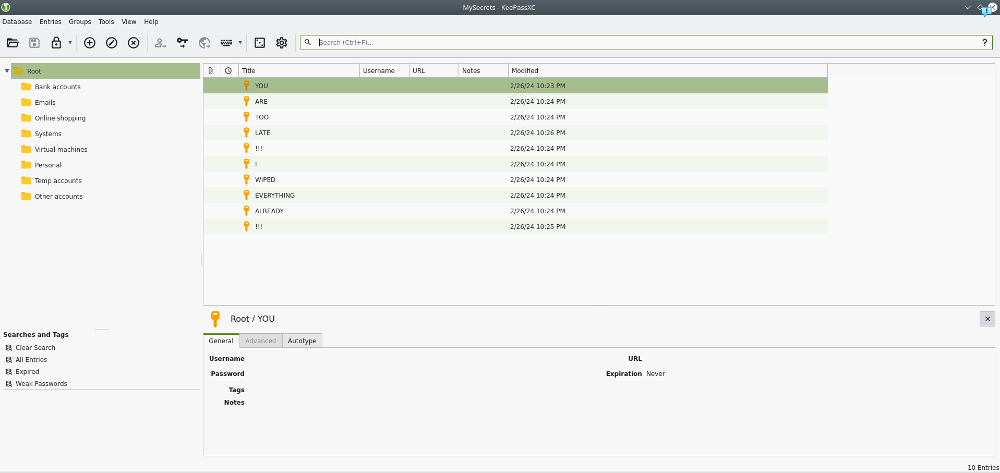
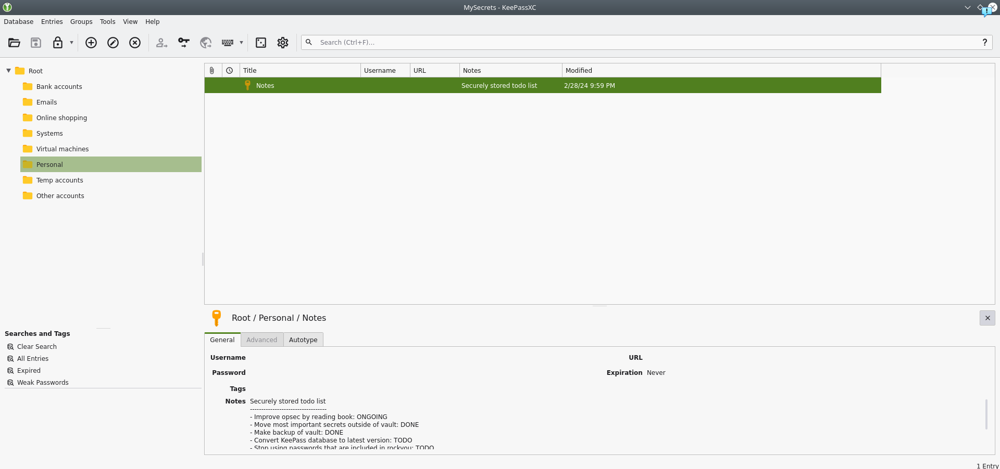
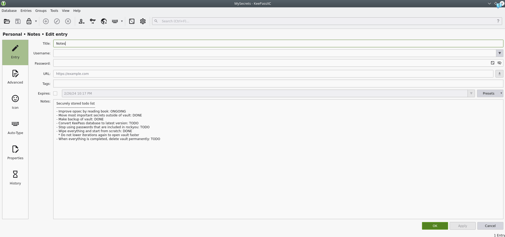
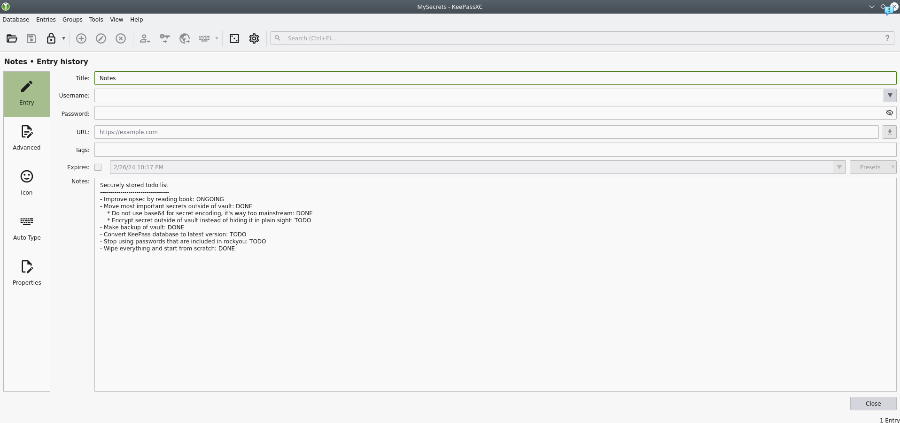
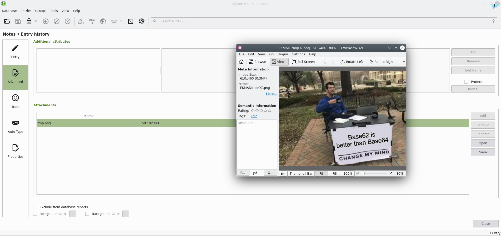

# Hidden Secrets

## Category
Forensics

## Estimated difficulty
Medium

## Description
CTF players get a zip file with 28 files, each with what appears to be a random name of 4 characters and an extension being a number from 0 to 27. These names are used to store the flag in plain sight by using a less frequently encountered encoding (base62). To get the flag they either have to fully guess this, just assume the flag is in the name and brute force encodings to find base 62 or follow the more obvious path of concatenating the files together in the right order and figuring out it's a KeePass database. When brute forcing the password of the database using rockyou as hinted in the scenario description, they get access to the vault. In there they can find various hints pointing them to flag being stored base62 encoded outside of the vault.

## Scenario
In the last week we have been analyzing all data that was collected from the workstation of a suspicious individual in the context of an investigation we are assisting on. We are still looking for some sensitive data that might be crucial for the investigation. Unfortunately, our forensic experts are not available at the moment and we need to know more about a suspicious zip file. The zip file is encrypted, but we already managed to crack it by blasting rockyou on it. However, we are none the wiser and really need results, the sooner the better. Can you assist and have a look? The password is 'hiddensecrets'.

## Write-up

1. We start by opening the encrypted zip file 'unknown.zip' with the provided password 'hiddensecrets'. At least it's an easy start.

2. We can see it contains 28 files, each with a name consisting of 4 random(?) characters and a number as extension.
    ``` shell
    $ ls
    3Ycs.0   6sJo.16  GVbA.18  JIw7.19  PGl5.17  s8Kz.25  u7Sc.10  vQtH.3   XSYT.20  zYrx.13
    4Me9.5   dYfr.22  iqQ3.9   kjg6.2   R8yC.8   SD8V.14  UfBu.23  X0kW.1   yIKl.11
    5DnZ.27  gnUv.4   Is47.26  lAzJ.6   RfaM.15  TyV8.7   UVAk.21  X62A.24  ZDgw.12
    ```

3. Let's check which type of files these are using the 'file' command. It appears most of them contain data according to file and one of them a KeePass password database, which, needless to say, looks definitely interesting.
    ``` shell
    $ file *
    3Ycs.0:  Keepass password database 2.x KDBX
    4Me9.5:  data
    5DnZ.27: data
    6sJo.16: data
    dYfr.22: data
    gnUv.4:  data
    GVbA.18: data
    iqQ3.9:  data
    Is47.26: data
    JIw7.19: DOS executable (COM)
    kjg6.2:  data
    lAzJ.6:  data
    PGl5.17: data
    R8yC.8:  data
    RfaM.15: data
    s8Kz.25: data
    SD8V.14: data
    TyV8.7:  data
    u7Sc.10: data
    UfBu.23: data
    UVAk.21: data
    vQtH.3:  data
    X0kW.1:  data
    X62A.24: data
    XSYT.20: data
    yIKl.11: data
    ZDgw.12: data
    zYrx.13: data
    ```

4. When opening the file and trying a random password, KeePass tells us it seems the file is corrupt. Given the numbers used as extensions on all the files,  most of them just being recognized as data and the one with the Keepass header being file 0, we'll try to concatenate the files in the order of the numbered extension to see what that gives.

   Bingo, when opening that one, we do no longer get the error, so this should actually be a valid KeePass database. This has to be be the location where the sensitive data is hidden. Unfortunately trying some quick password guesses doesn't seem to yield any results (of course, what did we expect?).

5. Since we concatenated the files, we'll do the same with the file names (see python script at the bottom) as it looks base64 encoded and then we can try to decode it.

   The result is:
   ```
   3YcsX0kWkjg6vQtHgnUv4Me9lAzJTyV8R8yCiqQ3u7ScyIKlZDgwzYrxSD8VRfaM6sJoPGl5GVbAJIw7XSYTUVAkdYfrUfBuX62As8KzIs475DnZ
   ```

   When trying to base64 decode this, we get what looks like random bytes, so I guess there is nothing here and we actually need to brute force the hidden vault as can be expected.

6. Let's get started: with keepass2john we can extract the hash from the database so we can crack it with JtR or hashcat.

   We'll just try with JtR and use the rockyou password list. We might also get lucky with this one.

    ``` shell
    $ keepass2john concatenated.kdbx > keepasshash.txt
    $ john --wordlist=./rockyou.txt keepasshash.txt 
    Using default input encoding: UTF-8
    Loaded 1 password hash (KeePass [SHA256 AES 32/64])
    Cost 1 (iteration count) is 24242 for all loaded hashes
    Cost 2 (version) is 2 for all loaded hashes
    Cost 3 (algorithm [0=AES 1=TwoFish 2=ChaCha]) is 0 for all loaded hashes
    Will run 4 OpenMP threads
    Press 'q' or Ctrl-C to abort, 'h' for help, almost any other key for status
    babyface123      (concatenated<SHOULD_BE_REMOVED_INCLUDING_COLON>)     
    1g 0:00:07:46 DONE (2024-02-28 22:56) 0.002142g/s 482.1p/s 482.1c/s 482.1C/s babygrl13..babyface01
    Use the "--show" option to display all of the cracked passwords reliably
    Session completed. 
    ```

    And boom, we are in! Password is 'babyface123'.

7. Time to investigate the vault:

   
   *Not a great start*

   
   *It's getting better*

   
   *Looks like a very useful todo list given how fast we got in the vault, but nothing sensitive. Wait, there is a history for this entry...*

   
   *No secrets yet, but very useful intel in the history. There are important secrets that are encoded, but not in base64 and they are not even stored inside the vault??*

   
   *Still no secrets, but the history also contains an image with even more intel. So I guess we are looking for sensitive data that is base62 encoded outside of the vault.*

8. The only other data we found came from the file names. Let's try to decode it now with base 62 instead of 64 with cyberchef or python (see python script at the bottom).

   The result is: 
   ``` 
    kjgvchf_I_Guess_This_Is_What_You_Are_Looking_For:CSC{Base64IsTooMainstreamAmirite?}
   ```

   Ok, that's the kind of secret we were looking for!

   The flag is: CSC{Base64IsTooMainstreamAmirite?}


Python script automating the required steps:
``` python
import subprocess

from pathlib import Path
from zipfile import ZipFile


zip_path = "./unknown.zip"
zip_password = "hiddensecrets"

# Extract zip file with provided password
with ZipFile(zip_path, "r") as zip:
    zip.extractall(path=".", pwd=zip_password.encode("utf-8"))

# Load file paths and sort according to number suffix
file_paths = sorted(Path(".").rglob("*.[0-9]*"), key=lambda x: int(x.name.split('.')[1]))

concat_file_name = "concatenated.ext"
# Concatenate files in right order
with open(concat_file_name, 'wb') as f:
  for p in file_paths:
    f.write(p.read_bytes())

print(f"Result written to file {concat_file_name}")

print("File type: {}".format(subprocess.check_output(f"file {concat_file_name}".split(' ')).decode().strip()))

# Concatenate file names in the right order
result = ""
for p in file_paths:
  result += p.name.split('.')[0]

print(f"Result concatenated file names: {result}")

# Try base 62 decode
# For example: https://github.com/suminb/base62/blob/develop/base62.py

BASE = 62
CHARSET_DEFAULT = "0123456789ABCDEFGHIJKLMNOPQRSTUVWXYZabcdefghijklmnopqrstuvwxyz"

def _value(ch, charset):
  """Decodes an individual digit of a base62 encoded string."""
  try:
    return charset.index(ch)
  except ValueError:
    raise ValueError("base62: Invalid character (%s)" % ch)


def decode(encoded, charset=CHARSET_DEFAULT):
  """Decodes a base62 encoded value ``encoded``.
  :type encoded: str
  :rtype: int
  """
  l, i, v = len(encoded), 0, 0
  for x in encoded:
    v += _value(x, charset=charset) * (BASE ** (l - (i + 1)))
    i += 1
  return v

def decodebytes(encoded, charset=CHARSET_DEFAULT):
  """Decodes a string of base62 data into a bytes object.
  :param encoded: A string to be decoded in base62
  :type encoded: str
  :rtype: bytes
  """
  leading_null_bytes = b""
  while encoded.startswith("0") and len(encoded) >= 2:
    leading_null_bytes += b"\x00" * _value(encoded[1], charset)
    encoded = encoded[2:]
  decoded = decode(encoded, charset=charset)
  buf = bytearray()
  while decoded > 0:
    buf.append(decoded & 0xFF)
    decoded //= 256
  buf.reverse()
  return leading_null_bytes + bytes(buf)

decoded = decodebytes(result)

print(f"Base 62 decoded result: {decoded.decode()}")

```

## Solve script
A solution script is included in resources folder.
The script automates the required steps to solve the challenge, excluding the brute forcing of the password of the KeePass vault.

## Flag
CSC{Base64IsTooMainstreamAmirite?}

## Creator
Jonas Van Wilder

## Creator bio
Jonas is a senior software engineer & cyber security consultant at NVISO, where he is a member of the R&D / Innovation team also known as NVISO Labs. His main focus is on managing and executing a number of key innovation projects related to cyber security services offered by NVISO. From time to time he still performs security assessments of mainly web applications and thick clients. Six years ago he also participated in the Cyber Security Challenge and he has been a contributor ever since.
