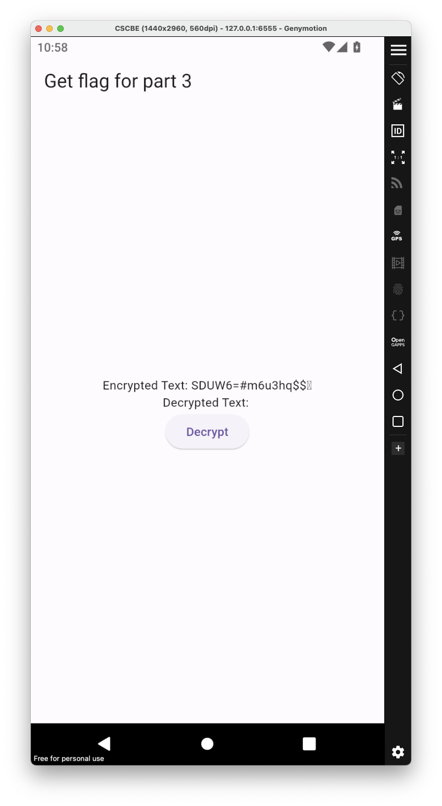
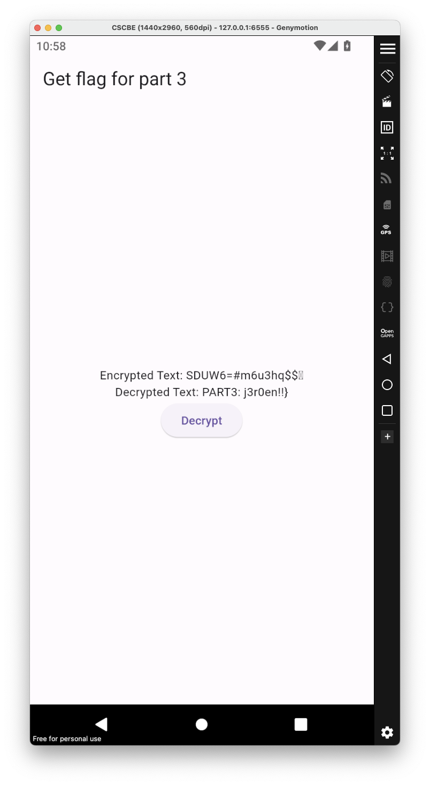

# Stop it Jeroen

## Category
Forensic

## Estimated difficulty
Medium

## Description
Android backup with 3 flags, one in SMS, one in pictures, one APK in downloads.

## Scenario
Jeroen won't stop bothering me for mobile challenges (even though he claims he doesn't). To mess with him, I've created one. Let's hope it's amusing, because I certainly am.

## Write-up

### Decompressing
Android backup can be decompressed then recompressed to at using([abe](https://github.com/nelenkov/android-backup-extractor/releases)):
```Bash
java -jar ~/Downloads/abe.jar unpack stop_it_jeroen.ab stop_it_jeroen.tar
mkdir out && cd out
tar xvf ../stop_it_jeroen.tar
tree .
.
├── apps
│   ├── android.ext.services
│   │   └── _manifest
.   .
.   .
.   .    
│   ├── com.android.providers.telephony
│   │   ├── _manifest
│   │   └── d_f
│   │       └── 000000_sms_backup
│   ├── com.android.quicksearchbox
│   │   ├── _manifest
│   │   ├── _meta
│   │   └── r
│   │       └── app_sslcache
│   ├── com.android.settings.intelligence
│   │   └── _manifest
│   ├── com.android.wallpaperbackup
│   │   ├── _manifest
│   │   └── f
│   │       ├── empty
│   │       └── wallpaper-info-stage
│   ├── com.android.wallpaperpicker
│   │   └── _manifest
│   └── org.chromium.webview_shell
│       └── _manifest
└── shared
    └── 0
        ├── Alarms
        ├── Audiobooks
        ├── DCIM
        ├── Documents
        ├── Download
        │   └── app.apk
        ├── Movies
        ├── Music
        │   └── audio_book_1.mp3
        ├── Notifications
        ├── Pictures
        │   ├── image-1.jpg
        │   ├── image-10.jpg
        │   ├── image-11.jpg
        │   ├── image-12.jpg
        │   ├── image-13.jpg
        │   ├── image-14.jpg
        │   ├── image-15.jpg
        │   ├── image-16.jpg
        │   ├── image-17.jpg
        │   ├── image-18.jpg
        │   ├── image-19.jpg
        │   ├── image-2.jpg
        .   .
        .   .
        .   .
        ├── Podcasts
        ├── Recordings
        └── Ringtones
```

### Image
Looking in all the images, one seems to be standing out:


Here we can read the part 1 of the flag:
CSC{Ple4se_no_

### SMS

When looking in the backup, there seems to be a backup of the sms database:
```
➜  apps tree com.android.providers.telephony 
com.android.providers.telephony
├── _manifest
└── d_f
    └── 000000_sms_backup

➜  d_f file 000000_sms_backup 
000000_sms_backup: zlib compressed data

➜  d_f binwalk -e 000000_sms_backup

DECIMAL       HEXADECIMAL     DESCRIPTION
--------------------------------------------------------------------------------
0             0x0             Zlib compressed data, default compression

➜  d_f cat _000000_sms_backup.extracted/0 | jq
[
  {
    "address": "+32 02 501 05 60",
    "body": "Hi peppypepper,\n\nI need to decode this ASAP:\nc1cXv+CSj/ZcEuWiAmhc2A==\n\nI cant find the key and IV used for this ciphertext(AES), try it out with our quantum computer.\n\nCapybara",
    "date": "1705403417349",
    "date_sent": "0",
    "status": "-1",
    "type": "2",
    "recipients": [
      "+32 02 501 05 60"
    ],
    "read": "1"
  },
  {
    "address": "+32025010560",
    "body": "Hi Agent Capybara,\n\nIt seems that the KEY is:\nrVFW/ti3JG5jDGnqfeBCFg==\n\nAnd the IV is:\n8iKvImQUZ/29N7rFEJYXuQ==\n\nBoth the KEY and the IV have been XORed with our secure keys.  Remember that the XOR keys are 2 bytes long.\n\nGood luck with your mission!",
    "date": "1705403514103",
    "date_sent": "1705403514000",
    "status": "-1",
    "type": "1",
    "recipients": [
      "+32 02 501 05 60"
    ],
    "read": "1"
  }
]
```

The payload to be decoded seems to be AES encrypted(xored key:rVFW/ti3JG5jDGnqfeBCFg== ^ ?? , xored iv:8iKvImQUZ/29N7rFEJYXuQ== ^ ??)

It is time to bruteforce the xor keys:
```Python
import sys
import os
import binascii
import base64
import time
import itertools

from Crypto.Cipher import AES
from Crypto.Util.Padding import unpad


def xor_bytes(xs: bytes, ys: bytes) -> bytes:
    return bytes(x ^ y for x, y in zip(xs, itertools.cycle(ys)))


def print_refreshing_string(s):
    for c in s:
        sys.stdout.write(c)
        sys.stdout.flush()
    sys.stdout.write("\r")
    sys.stdout.flush()


def main():
    if len(sys.argv) != 4:
        print(
            "Usage: python aes_xor_brute.py <aes_base64> <key_xor_base64> <iv_xor_base64>"
        )
        return

    aes_ciphertext = base64.b64decode(sys.argv[1])
    key_xor = base64.b64decode(sys.argv[2])
    iv_xor = base64.b64decode(sys.argv[3])
    for i in range(0, 256):
        for j in range(0, 256):
            xorkey = i.to_bytes(1, "big")
            xoriv = j.to_bytes(1, "big")
            key = xor_bytes(key_xor, xorkey)
            iv = xor_bytes(iv_xor, xoriv)
            print_refreshing_string(f"XOR key: {hex(i)} XOR iv: {hex(j)}")
            try:
                cipher = AES.new(key, AES.MODE_CBC, iv)
                decryptedtext = unpad(cipher.decrypt(aes_ciphertext), AES.block_size)
                print("\n" + decryptedtext.decode("utf-8"))
            except:
                pass


if __name__ == "__main__":
    main()
```

```Bash
➜  Resources python3 aes_xor_brute.py c1cXv+CSj/ZcEuWiAmhc2A== rVFW/ti3JG5jDGnqfeBCFg== 8iKvImQUZ/29N7rFEJYXuQ==
XOR key: 0xae XOR iv: 0xe8
RCPV08o2`kng]
XOR key: 0xae XOR iv: 0xea
PART2:m0bile_
XOR key: 0xae XOR iv: 0xeb
Q@SU3;l1chmd^
```

PART2: m0bile_

### APK
There is an APK in the download file:
```bash
➜  0 tree Download
Download
└── app.apk
```

If we start the app.apk there is a button that allow to decrypt:


A simple click on the button will decrypt the text:


PART3: j3r0en!!}

The flag is therefore **CSC{Ple4se_no_m0bile_j3r0en!!}**

## Solve script
N/A

## Flag
CSC{Ple4se_no_m0bile_j3r0en!!}

## Creator
Julian Dotreppe

## Creator bio

