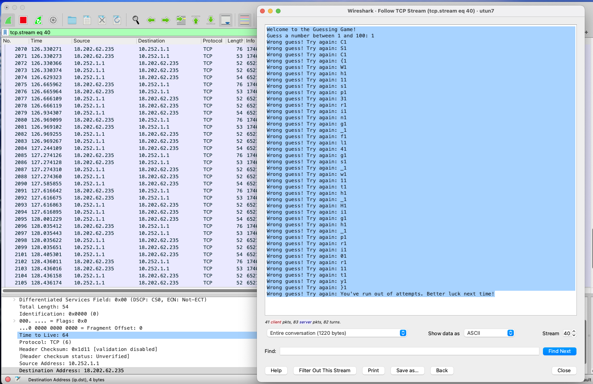

# Capture The Flag

## Category
Misc

## Estimated difficulty
Medium

## Description
Contestant connects with netcat and is presented a guessing game. Each time they guess wrong, one character of the flag is sent as TCP Out-of-Band data. This way, it doesn't show up in the user's terminal, but they can 'capture the flag' with packet capture tools like Wireshark, tcpdump, ...

## Scenario
### OLD
Play the game, capture the flag.
### NEW
Look, if you had one shot or one opportunity
To seize everything you ever wanted in one moment
Would you capture it or just let it slip?
[Eminem, 2002]

Don't worry, for this challenge you can capture it even when you let it slip.

## Write-up

Connecting via netcat you're presented with a guessing game. When guessing right, you get a 'piece of the flag' (just "CSC{"), which doesn't help much. The challenge description says "Play the game, capture the flag.", not "Win the game, capture the flag.". The challenge title and description hint that you should use a packet capture tool like Wireshark or tcpdump to capture the incoming traffic while playing the game. You'll notice that every time you guess wrong (and thus are still playing the game), a TCP '[Out-of-Band Data](https://www.gnu.org/software/libc/manual/html_node/Out_002dof_002dBand-Data.html)' packet is sent to your machine containing one character of the flag. This data will not show up in a netcat connection to the server, but will be visible with packet capture tools, for example by 'following the TCP stream' in Wireshark. Guessing wrong enough times allows you to capture the complete flag.

## Flag
CSC{Wh1sp3ring_fl4gs_w1th_High_pri0r1ty}

## Creator
Alex Van Mechelen

## Creator bio
Alex is a master student polytechnics at the Royal Military Academy. He is former contestant from the teams Royal Military Hackademy & DIG174L. He hopes you'll have a great time solving his challenges!
