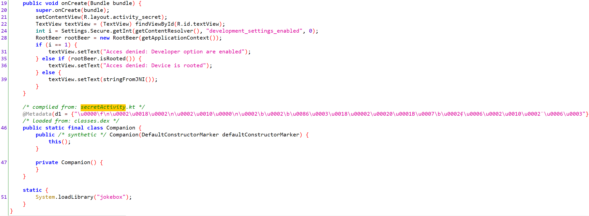
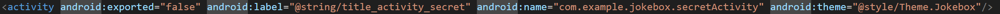
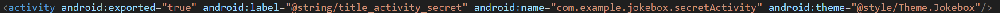
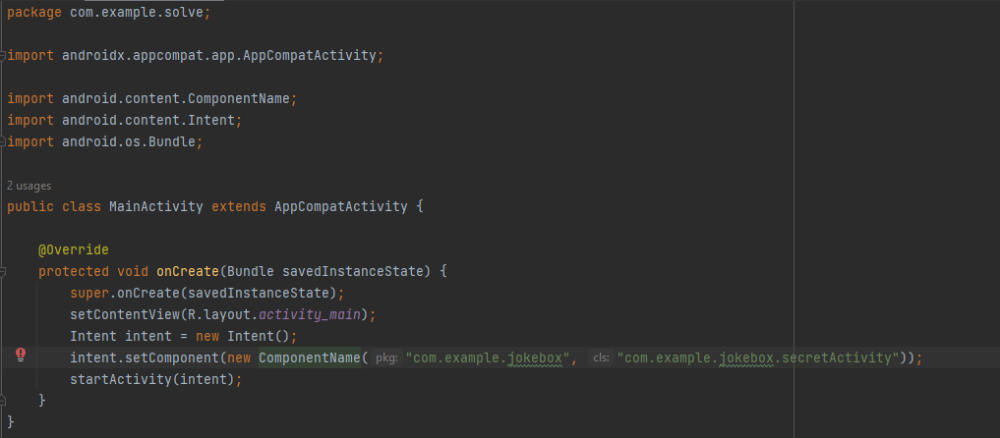
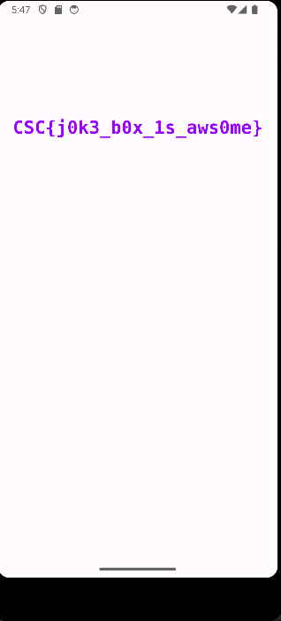

# Jokebox

## Category
Mobile

## Estimated difficulty
Medium

## Description
The concept behind this Android Challenge is as follows: Users are given an APK file. Essentially, the MainActivity is a simple game where the objective is to tap on a jukebox that produces random sounds, though it has no importance. The primary aim of the challenge is to gain access to a hidden activity by using a specially developed application designed to launch the activity. Then, the secret activity will reveal the flag by utilizing an obfuscated native function.

## Scenario
I encountered a random eccentric guy who shared with me an unusual mobile application. (Who actually does that seriously ?!) At first glance it appears to be a simple soundboard, but the guy insisted that a hidden secret lies within. He also told me to keep the sound turned on while I'm using the app but I'm not sure if it's very helpful, this guy was very weird... Could you retrieve the secret ?

## Write-up
Let's first decompile the apk in a tool such as jadx-gui.

We see that there are two activities: MainActivity and secretActivity.
By looking closer a the secretActivity's source code we can see that the code does several things: It first checks if developper options are enabled, then it checks if the device is rooted. 
If none of these conditions are met, it prints a string retrieved from a native C++ function. The issue here is that the secretActivity is never called. However, we can create our own application that will then launch the secretActivty.
First thing first we have to modify the AndroidManifest.xml. The trick here is to change the statement exported=false to exported=true for the secretActivity, enabling it to be invoked by external applications.  
Before

After

Let's decompile the app using apktool d jokebox.apk. Then modify the AndroidManifest.xml. We now have to recompile, sign and reinstall the apk on our device. When recompiling the app you might face multiple issues. Make sure that apktool is up to date, try both version (Windows & Linux). Then align the apk using zipalign or apktool GUI.
Using Android Studio, we have to create an Android application that will launch our secretActivity. The following code should do the job.
  
We now have to compile our application. On Android Studio go to Build -> Generate signed Bundle / APK. We then launch our application and voila ! We get the flag.  

## Solve script
PUT IT IN THE `Resources` FOLDER AND MENTION IT IN THE `healthcheck:` of `challenge.yml`

## Flag
CSC{j0k3_b0x_1s_aws0me}

## Creator
Louis Flamion

## Creator bio
  
Louis Flamion is a Cybersecurity consultant currently working at Thales Cyber Solutions. He likes to play CTF on his free time mainly focusing on Forensics, Web and Android challenges. Whenever the opportunity arises, he enjoys crafting challenges that provide both fun and learning opportunities.

- https://www.linkedin.com/in/louis-flamion-425a88235/
