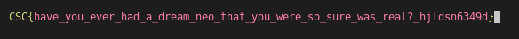

# NEO

## Category
Programming

## Estimated difficulty
Medium

## Description
Python script that outputs ANSI escape codes

## Scenario
Are you the one? Can you escape the code and see the Matrix? Absolutely, Neo Sees It.

## Write-up
This challenge uses ANSI escape codes. It first prints a fake flag in red. At each iteration, a random index in the flag is chosen. The character at this index is first replaced by the correct character (printed in green) and immediately replaced again by another incorrect character in red. These iterations happen too fast to be readable.



The easiest way to solve the challenge is to save the output to a file.

```bash
python3 chall.py > output.txt
```

The output looks like this:

`[REDACTED] oV ...`

Each escape code starts with `[`. Afterwards, there are four different codes.

- `;YH` sets the cursor location to row X, column Y
- `X` prints character X in GREEN
- `X` prints character X in RED
- `` resets the colour of the terminal

So the above sequence first replaces the character at index 35 by the correct letter `o` and then immediately switches it to the incorrect letter `V`

The following Python script takes `output.txt`, removes unreadable characters and uses regex to extract the correct flag characters.

```py
import re

def remove_ansi_escape_sequences(input_string):
    cleaned_string = re.sub('\x1b','',input_string)
    cleaned_string = re.sub('\[','',cleaned_string)
    cleaned_string = re.sub('\x00','',cleaned_string)
    return cleaned_string

with open('output.txt','r') as f:
    text = f.read()
    text_filtered = remove_ansi_escape_sequences(text)
    matches = re.findall("0;(\d+)H92m(.)",text_filtered)

fake_flag = "CSC{have_you_ever_had_a_dream_neo_that_you_were_so_sure_was_real?_hjldsn6349d}"
flag = list(fake_flag)
for match in matches:
    index, char = match
    flag[int(index)-1] = char
print(''.join(flag))
```

## Flag
CSC{you_have_to_understand_most_people_are_not_ready_to_be_unplugged_35uf83js}

## Creator
Jules Oosterlynck

## Creator bio
Jules is a consultant at McKinsey & Company. He is a former contestant from the team 'Royal Military Hackademy'. In his free time, he enjoys hiking, running and learning about technology.


- https://www.linkedin.com/in/jules-oosterlynck/
