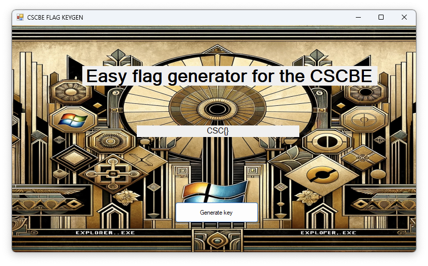
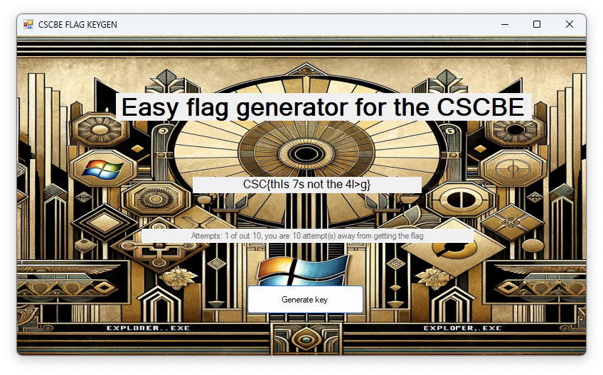
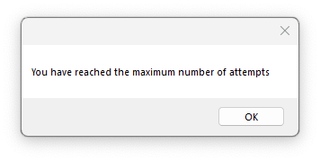
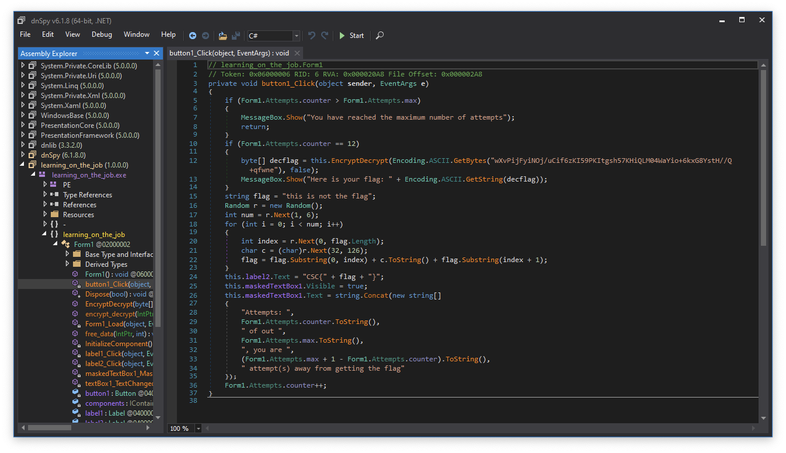
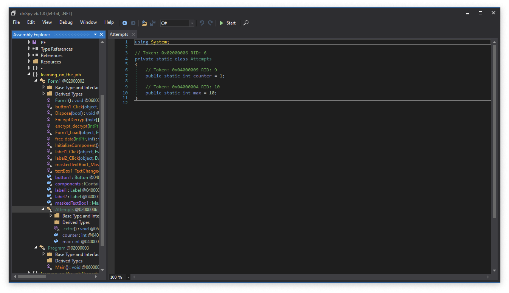
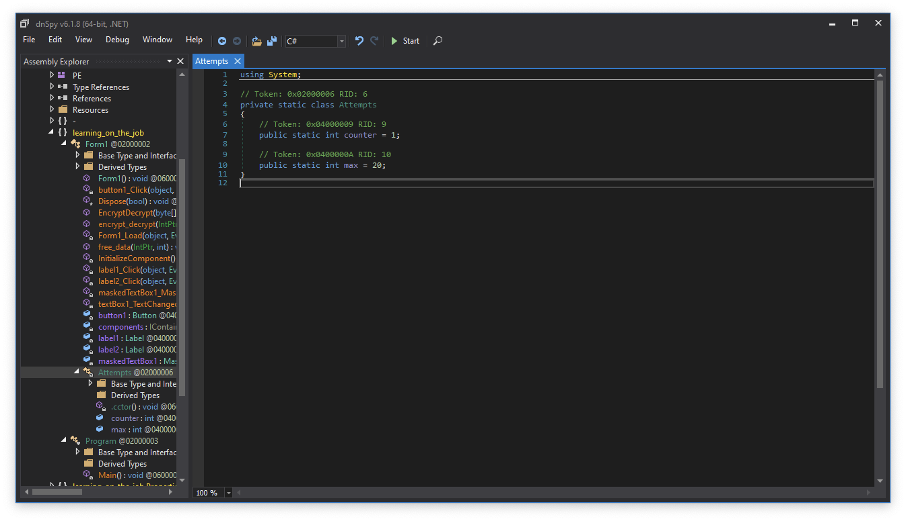
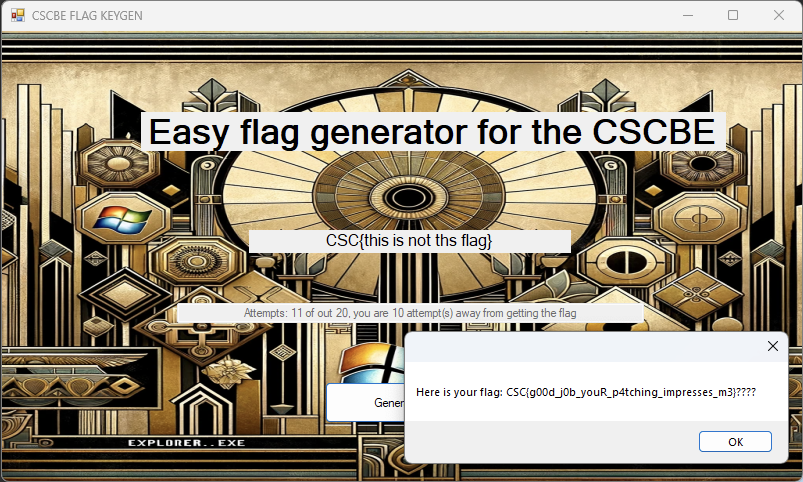

# Learning on the job

## Category
Reversing

## Estimated difficulty
Easy

## Description
It is a dot not binary that generate random flag, there is a limited number of attempts allowed, at the 11th attempt the flag is printed. By default it is not reachable so contestants need to patch it.

## Scenario
Today is my first day in a big corp, I've started working at Lazarus Group(aka APT38). For my first day my employer asked me to generate a keygen for the CSCBE so we can easily win the competition.
It didn't worked for me, hope it will for you 😉

## Write-up
The application once started look like this:

It is possible to generate "keys" aka flags:

Note that we generated 1 flag and that we have 10 attemps. Getting to the 11th attempt seems to allow us to get the flag.

After 10 attemps we indeed have this error message:

As it is .NET code it can be decompiled into almost the source, therefore decompiling the app using dnsSpy gives this:

There are two interesting things:
* We can see that indeed there is a if statement that check if the number of attempt based on the Attemps.max value
* The flag seems to be printed at the 12th attempt

Looking at the Attempts class we can see that it has the current Attemps.max set to 10:

From there multiple solutions can be used to increase the max number of attempts to 20 in memory so we can hit the condition to get the flag.:
* Use a debugger
* Patch the binary

Let's patch the binary as it is funier:

The value of Attempts.max is now set to 20.

Running the app should now print the flag:

## Solve script

## Flag
CSC{g00d_j0b_youR_p4tching_impresses_m3}

## Creator
Julian Dotreppe

## Creator bio
