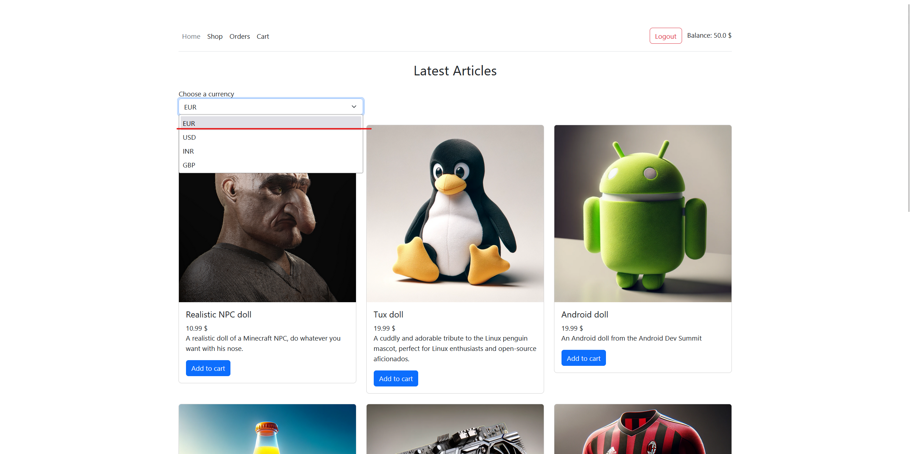
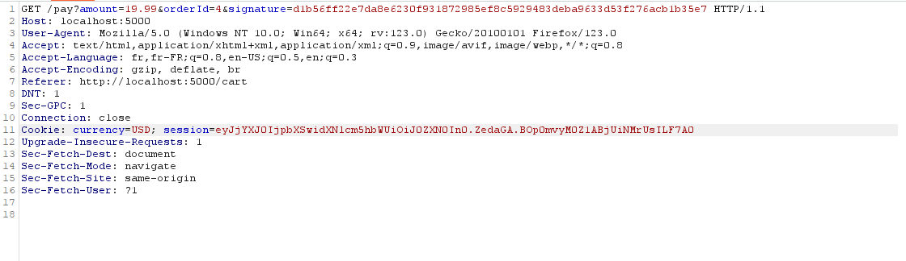
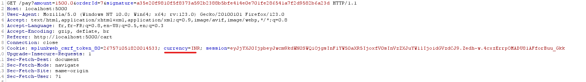
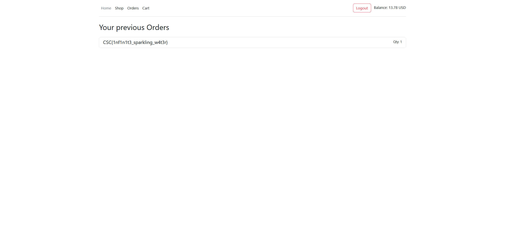
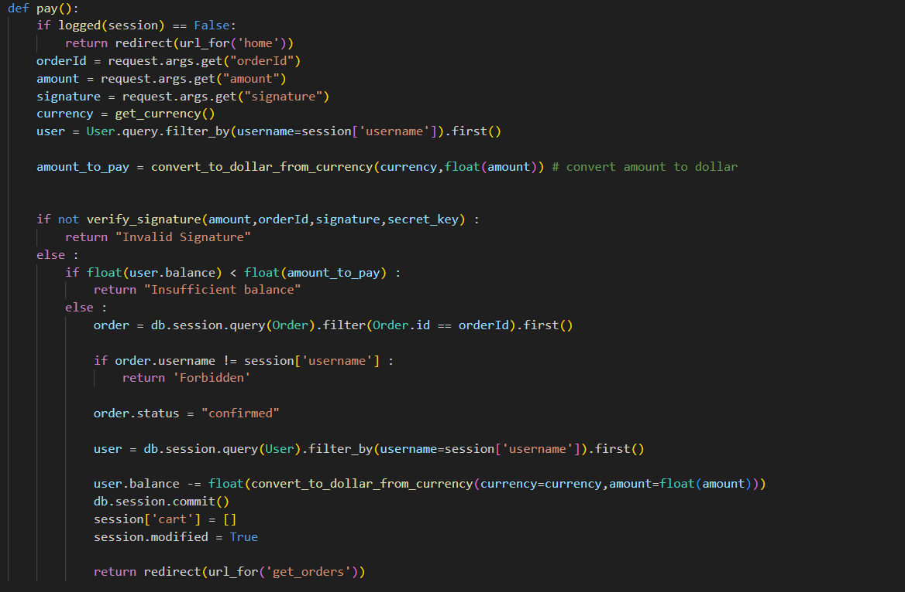

# Ali Booba Webshop

## Category
Web

## Estimated difficulty
Easy

## Description
This challenge involves exploiting a flaw in the payment process: The user is required to purchase an expensive item worth $1500 while only having a balance of $50. During the payment process, the server receives parameters including the amount, order ID, and signature. The amount cannot be altered as the signature verification would fail. However, the currency set through a cookie is utilized in calculating the payment amount but is not included in the signature, allowing the purchase of the item for approximately 1500 rupees, equivalent to $18.

## Scenario
My friend, who can be quite bothersome at times, is flaunting his expensive new acquisition, Bugatti Sparkling Water. We purchased it from an unfamiliar online store. Could you do me a favor and purchase this "Bugatti sparkling water" so I can flex on him?

## Write-up
Once logged in, notice that you can change your currency.

Add the "Bugatti Sparkling water" to the cart and try to buy it. The payment will fail but you'll notice the payment request. The amount parameter is sent alongside the orderId. However, tampering them will result in an invalid signature.

 

If we change the currency to the INR, the request is sucessfully processed because the currency is not part of the signature but it used during the calculation of the total price. Meaning we could afford the Bugatti Sparkling water for 1500 INR = 18 $

We then get the flag

The bug arrises because when calculating the signature, the currency is not taken into account. However the currency is used when it comes to calculating the total price of the cart.

## Solve script
PUT IT IN THE `Resources` FOLDER AND MENTION IT IN THE `healthcheck:` of `challenge.yml`

## Flag
CSC{1nf1n1t3_sparkling_w4t3r}

## Creator
Louis Flamion

## Creator bio

Louis Flamion is a Cybersecurity consultant currently working at Thales Cyber Solutions. He likes to play CTF on his free time mainly focusing on Forensics, Web and Android challenges. Whenever the opportunity arises, he enjoys crafting challenges that provide both fun and learning opportunities.

- https://www.linkedin.com/in/louis-flamion-425a88235/
